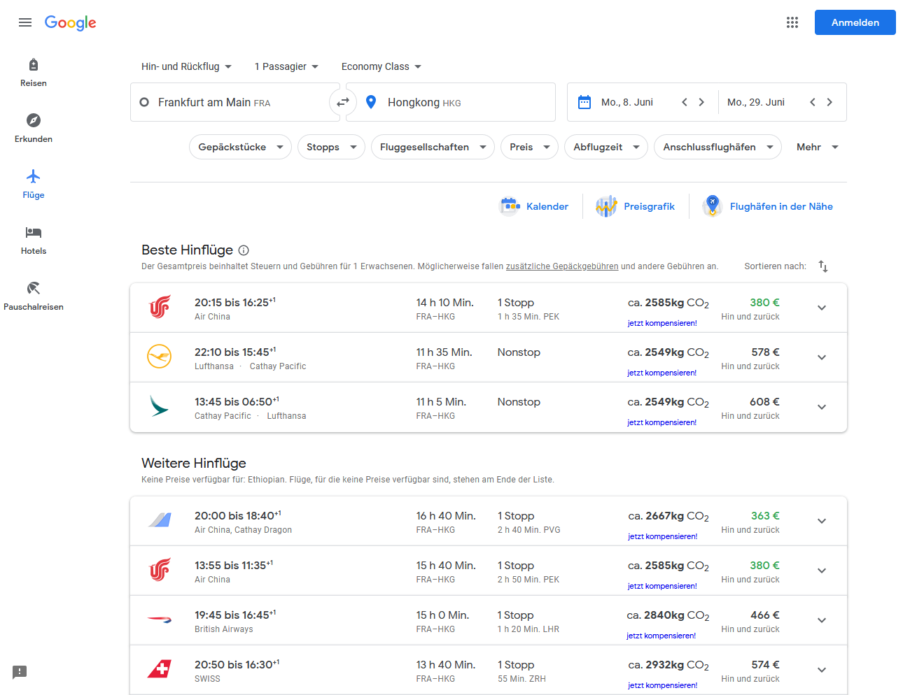

# Google Flights CO₂ extension

Adds information about CO₂ emissions to results on Google Flights.

## Quick Start

1. Clone repository
1. Create `secrets.json` file with API credentials from Atmosfair.
2. Run `yarn install --dev` to install dependencies
3. Run `yarn dev`. This will open a Firefox window with the plugin already loaded and hot-reload enabled.
5. Open [flights.google.com](flights.google.com)
6. Search for something

## Add-on build process

1. Run `yarn install --dev`.
2. Run `yarn build`.
3. Extension is in ./web-ext-artifacts and ready to upload.